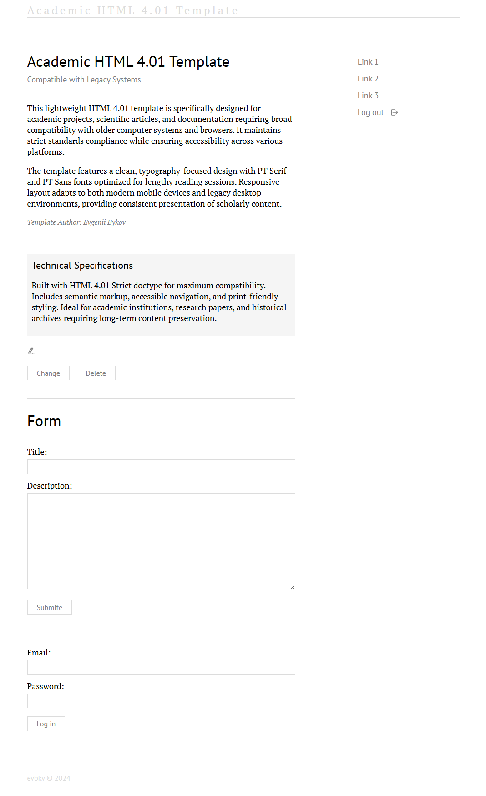

# Academic HTML 4.01 Template

A lightweight, standards-compliant HTML 4.01 template designed for academic projects, scientific articles, and documentation requiring broad compatibility with legacy systems and modern browsers.

## Features

* **HTML 4.01 Strict Compliance**: Maximum compatibility with older computer systems and browsers
* **Responsive Design**: Adapts to both modern mobile devices and legacy desktop environments
* **Academic Typography**: PT Serif and PT Sans fonts optimized for lengthy reading sessions
* **Clean Semantic Markup**: Properly structured content for accessibility and SEO
* **Print-Friendly Styling**: Optimized for both digital and print media
* **Legacy Browser Support**: Works reliably on older systems while maintaining modern features

## Technical Specifications

- HTML 4.01 Strict Doctype
- CSS with media queries for responsive layout
- SVG icons for scalability
- Accessible navigation with keyboard support
- Cross-browser compatible styling
- Lightweight and fast loading

## Ideal For

- Academic institutions and research papers
- Scientific documentation and archives
- Historical projects requiring long-term preservation
- Government and organizational documentation
- Projects needing maximum browser compatibility

## Quick Start

1. Download the template files
2. Edit `index.html` with your content
3. Customize `style.css` to match your branding
4. Deploy to any web server

## File Structure

ahtml401tmp/
├── index.html # Main template file
├── style.css # Stylesheet
└── screenshot.png # Template preview

## Browser Compatibility

* Modern browsers (Chrome, Firefox, Safari, Edge)
* Legacy browsers (IE6+, older versions)
* Mobile devices (iOS, Android)
* Text-based browsers (Lynx, etc.)

## Screenshot

## Author

[Evgenii Bykov](https://github.com/evbkv)

## License

GNU General Public License v3.0

---

*Preserving academic content with modern web standards and legacy compatibility.*